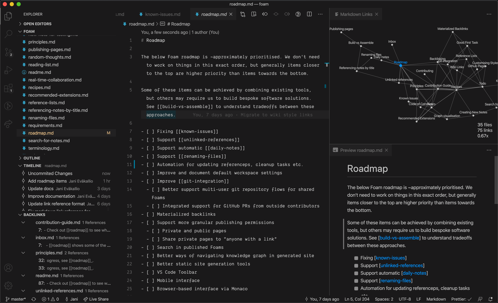
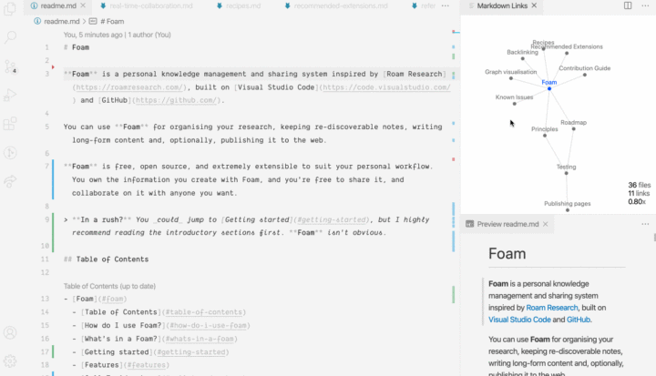

# Foam

👋 欢迎来到Foam工作区，Form是一个受到Roam Research启发的个人笔记与知识管理思维导图系统，基于 VSCode + MarkDown + GitHub。

## 安装

假定你已经有GitHub账号，并且已经在你的Linux/MacOS/Windows上安装了[Visual Studio Code](https://code.visualstudio.com/) 。

1. 如果还没有准备好，请查看 [Foam工作区](https://foambubble.github.io/foam) 去了解什么是Foam和如何使用。
2. 点击[foam模板](https://github.com/g00g1e/foam-template/generate) (也就是本项目) 分叉至你的GitHub账号. 如果需要保密，请选择私有项目。
3. [克隆模板仓库到你的电脑](https://help.github.com/cn/github/creating-cloning-and-archiving-repositories/cloning-a-repository) 并使用VS Code 打开它。
4. 右下角会弹窗提示推荐安装插件, 点击 **Install all** (如果需要查看具体插件可以点击 **Show Recommendations** 然后再陆续点Install/安装)

完成以上步骤后，打开[.vscode/settings.json](.vscode/settings.json) 可以按喜好编辑、添加或删除Foam工作区配置。

了解更多 **Foam**, 请查看[Recipes](https://foambubble.github.io/foam/recipes) 

## 使用Foam

模板已经创建了一些思维泡泡 (markdown格式) 便于你快速上手。

- [[inbox]] - 用于快速收集想法，后续再整理归类。
- [[foam-tips]] - 充分利用Foam工作区的技巧。
- [[todo]] - 用于记录待办事项。

VS Code中查看图像--可视化信息关联：快捷键Cmd+Shift+P，输入 Show Graph回车；
VS Code中查看Markdown文档预览： 快捷键Cmd+Shift+V

## 注意事项 `[[wiki-links]]`

⚠️ 在 [foambubble/foam#16](https://github.com/foambubble/foam/issues/16) 问题解决之前, `[[wiki-links]]` wiki链接 (如前示例) 无法在GitHub预览中正确显示(例如，本Readme文档)。 

他们只能在VS Code和已渲染的GitHub Pages中正确显示.

如果需要在GitHub预览或者其他markdown编辑器中正确显示链接，请使用标准语法： `[description](page.md)` 。

[//begin]: # "Autogenerated link references for markdown compatibility"
[inbox]: inbox "Inbox"
[foam-tips]: foam-tips "Foam tips"
[todo]: todo "Todo"
[//end]: # "Autogenerated link references"
